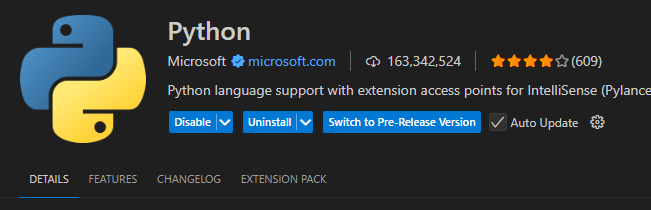
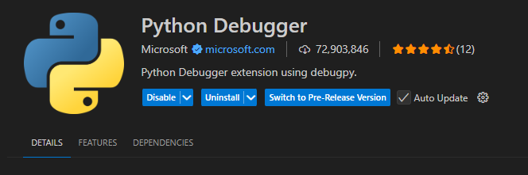
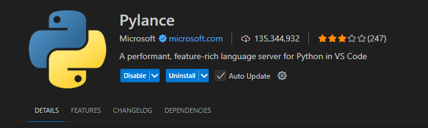
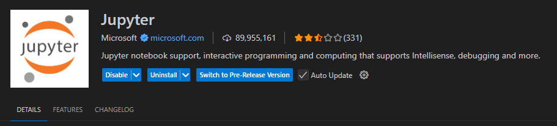
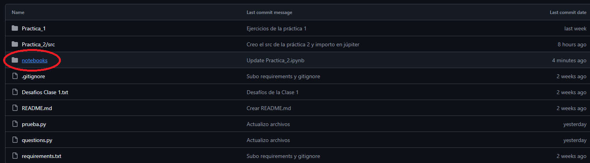
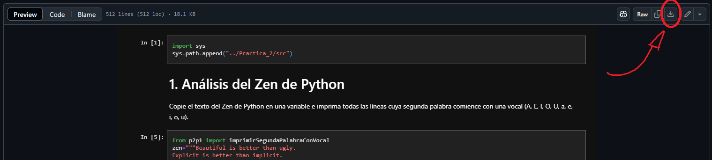

# Agustín Ortiz  27068/6
Como ejecutar mis códigos:
## Paso 1: Instalar Python
En este repositorio, todo mi código está programado en Python, por lo que es necesario instalarlo para poder correrlos.
Para instalar Python correctamente, siga los pasos en la siguiente guía: https://python-unlp.github.io/blog/2023/04/22/instalación-de-python/
## Paso 2: Instalar Visual Studio Code
En realidad podría ser cualquier otro IDE que permita programar en Python, pero yo personalmente uso Visual Studio.
Para descargarlo hay que entrar al siguiente link y descargar la versión correspondiente para su sistema operativo: https://code.visualstudio.com/Download
## Paso 3: Instalar las extensiones de Visual Studio
Para poder instalar las extensiones que yo uso, haga click en el apartado de extensiones a la izquierda (o presione CTRL SHIFT X), y busque e instale las siguientes:
Python
Python Debugger 
Pylance
Jupyter
## Paso 4: Creación del entorno virtual
Mis códigos se ejecutan desde Jupyter Notebook, una aplicación que permite crear, importar y ejecutar código de manera interactiva. Aunque no requiere un entorno virtual para funcionar, es recomendable usar uno para aislar las dependencias del proyecto. Para ello, primero se debe crear y activar un entorno virtual en Python, instalar Jupyter dentro de él y luego ejecutarlo.
Para poder crear un entorno virtual correctamente, siga los pasos de la siguiente guía: https://python-unlp.github.io/blog/2023/04/29/entornos-virtuales/
## Paso 5: Instalar las dependencias
Actualmente la única dependencia es Jupyter Notebook, por lo que para instalarlo se debe abrir la terminal, activar el entorno virtual y ejecutar el comando de instalación, de la siguiente manera:
scripts/venv/scripts activate (o source venv/bin/activate para los usuarios de Linux)
Con este primer comando vamos a activar el entorno virtual, y luego se debe ingresar:
pip install notebook==7.3.3.
## Paso 6: Descargar los archivos y ejecutar Jupyter
Una vez descargado Jupyter, lo único que hace falta es descargar el notebook de la práctica y su código fuente. Para esto, entre a la carpeta "notebooks" tal cual se indica en la siguiente imagen:

Y una vez ahí, descargue la práctica deseada haciendo click sobre su nombre y luego en el botón "download raw file", tal cual se indica en la siguiente imagen:

Luego, regrese al principio del repositorio, entre a la carpeta correspondiente a la práctica y descargue todo el contenido de la carpeta "src", guardelo en una carpeta con el nombre "src" y luego guarde esa carpeta en otra con el nombre "Practica_2"
## Paso 7: Activar el entorno virtual en Jupyter y correr el código:
Cuando se abra el notebook de la práctica, en la parte superior derecha debería aparecer un selector de kernel, vamos a hacer click en el y seleccionar la opción que diga/contenga la palabra "venv".
Una vez seleccionado el kernel, debemos hacer click en la primer casilla de código que aparece, y presionar CTRL ALT ENTER a la vez. De esta manera importaremos las funciones descargadas previamente y ya podremos ejecutar libremente el resto del código presionando en su casilla y luego CTRL ALT ENTER para ejecutarlo.
